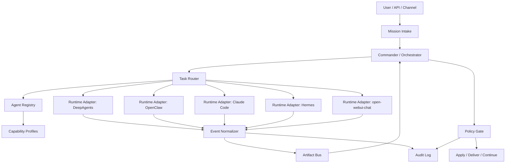
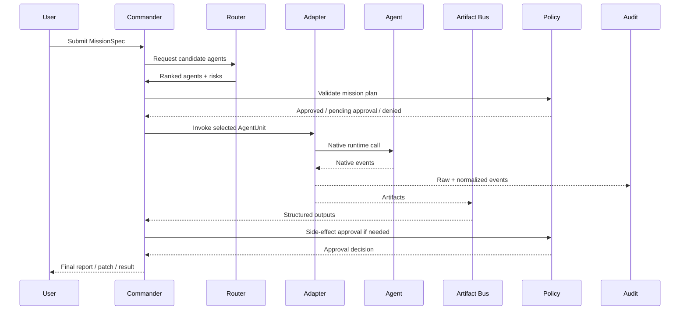

# AgentLegion Architecture

## 1. Overview

AgentLegion is a control plane for coordinating heterogeneous agents.

## 2. Layers

### Layer 1: Agent Registry

The registry stores all known `AgentUnit` records.

It answers:

- What agents exist?
- Which runtime backs each agent?
- Which adapter invokes it?
- What role does it play?
- Is it available?
- What trust level does it have?

### Layer 2: Capability Profile

The capability profile stores what the agent can do.

Capabilities are not raw tool names. They are operational abilities:

- `read_files`
- `write_files`
- `run_shell`
- `use_mcp`
- `spawn_subagents`
- `bind_channels`
- `schedule_tasks`
- `produce_patch`
- `review_code`
- `perform_research`

### Layer 3: Runtime Adapter

Adapters translate legion tasks into native runtime calls.

They must:

- validate whether the runtime can satisfy a task
- compile an invocation plan
- invoke the runtime
- stream normalized events
- preserve raw native events
- support cancellation where possible
- report runtime-local status

### Layer 4: Task Router

The router selects agents for tasks based on:

- required capabilities
- domain expertise
- input/output contracts
- risk level
- availability
- cost
- latency
- policy constraints

### Layer 5: Commander / Orchestrator

The commander decomposes missions into steps.

Common orchestration patterns:

- commander-workers
- fixed pipeline
- router-only
- blackboard
- swarm/market
- reviewer-gate

### Layer 6: Artifact Bus

The artifact bus is the shared workspace of the legion.

Agents exchange:

- findings
- plans
- patches
- reviews
- reports
- decisions
- evidence bundles

The artifact bus avoids giving every agent every raw transcript.

### Layer 7: Policy / Audit / Control Plane

The control plane governs:

- tool access
- shell execution
- file writes
- network access
- MCP installation
- secrets
- channel sends
- scheduled runs
- subagent spawning
- approvals
- audit logs

## 3. Mission Lifecycle

## 4. Event Model

AgentLegion uses a normalized event envelope but never discards raw runtime events.

Minimal event types:

- `started`
- `message`
- `tool_call`
- `tool_result`
- `approval_required`
- `approval_result`
- `artifact`
- `checkpoint`
- `completed`
- `failed`
- `cancelled`
- `raw`

## 5. State Model

AgentLegion distinguishes between:

- legion state
- mission state
- artifact state
- runtime-local state

Runtime-local state is not assumed to be portable.

Examples:

- Claude Code sidechain transcript
- DeepAgents / LangGraph checkpointer state
- OpenClaw session registry
- Hermes checkpoint/session DB
- open-webui chat JSON

## 6. Safety Boundary

AgentLegion is not itself a sandbox.

It is a control plane that must integrate with runtime-native sandboxing, approvals, and policy enforcement.

Every adapter must report:

- supported permissions
- unsupported permissions
- sandbox coverage
- tool provenance
- side-effect risks
- secret exposure risks

